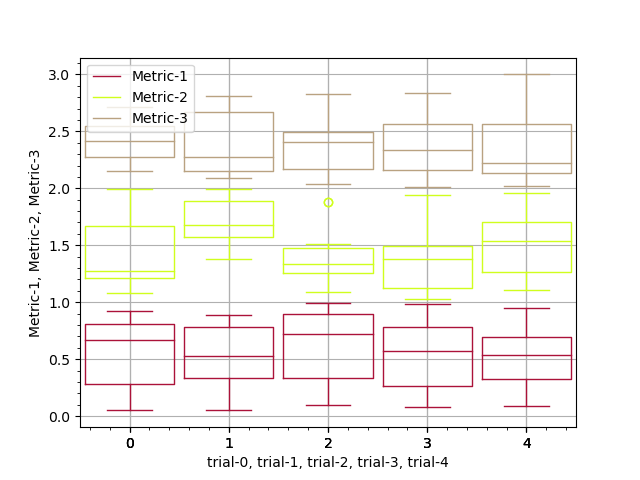
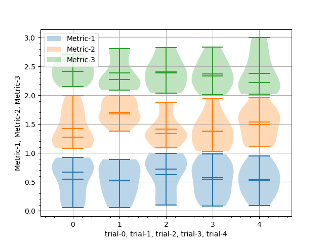

# PyABSA - Open Framework for Aspect-based Sentiment Analysis


[](https://pypi.org/project/pyabsa/)
[](https://pypi.org/project/pyabsa/)


[](https://github.com/yangheng95/PyABSA/tree/traffic#-total-traffic-data-badge)
[](https://github.com/yangheng95/PyABSA/tree/traffic#-total-traffic-data-badge)
[](https://github.com/yangheng95/PyABSA/tree/traffic#-total-traffic-data-badge)
[](https://github.com/yangheng95/PyABSA/tree/traffic#-total-traffic-data-badge)

[](https://paperswithcode.com/sota/aspect-based-sentiment-analysis-on-semeval?p=back-to-reality-leveraging-pattern-driven)

**Hi, there!** Please star this repo if it helps you! Each Star helps PyABSA go further, many thanks.
# | [Overview](../README.MD)  |  [About HuggingfaceHub](huggingface_readme.md)  |  [About ABDADatasets](dataset_readme.md)  |  [About Models](model_readme.md) |  [About Application](tutorial_readme.md) |  


### Metric Visualization

If you need to visualize the difference between the metrics, you can
use [MetricVisualizer](https://github.com/yangheng95/metric_visualizer). Here is an example of using MetricVisualizer to
visualize the FAST_LCF_BERT metrics under different max_seq_lens.

```python3
import autocuda
import random

from metric_visualizer import MetricVisualizer

from pyabsa.functional import Trainer
from pyabsa.functional import APCConfigManager
from pyabsa.functional import ABSADatasetList
from pyabsa.functional import APCModelList

import warnings

from pyabsa import __version__
assert __version__ >= '1.8.20'

from metric_visualizer import __version__
assert __version__ >= '0.4.0'

device = autocuda.auto_cuda()
warnings.filterwarnings('ignore')

seeds = [random.randint(0, 10000) for _ in range(3)]

max_seq_lens = [60, 70, 80, 90, 100]

apc_config_english = APCConfigManager.get_apc_config_english()
apc_config_english.model = APCModelList.FAST_LCF_BERT
apc_config_english.lcf = 'cdw'
apc_config_english.max_seq_len = 80
apc_config_english.cache_dataset = False
apc_config_english.patience = 10
apc_config_english.seed = seeds

MV = MetricVisualizer()
apc_config_english.MV = MV

for eta in max_seq_lens:
    apc_config_english.eta = eta
    dataset = ABSADatasetList.Laptop14
    Trainer(config=apc_config_english,
            dataset=dataset,  # train set and test set will be automatically detected
            checkpoint_save_mode=0,  # =None to avoid save model
            auto_device=device  # automatic choose CUDA or CPU
            )
    apc_config_english.MV.next_trial()

apc_config_english.MV.summary(save_path=None, xticks=max_seq_lens)
apc_config_english.MV.traj_plot_by_trial(save_path=None, xticks=max_seq_lens)
apc_config_english.MV.violin_plot_by_trial(save_path=None, xticks=max_seq_lens)
apc_config_english.MV.box_plot_by_trial(save_path=None, xticks=max_seq_lens)

save_path = '{}_{}'.format(apc_config_english.model_name, apc_config_english.dataset_name)
apc_config_english.MV.summary(save_path=save_path)
apc_config_english.MV.traj_plot_by_metric(save_path=save_path, xticks=max_seq_lens, xlabel=r'max_seq_len')
apc_config_english.MV.violin_plot_by_metric(save_path=save_path, xticks=max_seq_lens, xlabel=r'max_seq_len')
apc_config_english.MV.box_plot_by_metric(save_path=save_path, xticks=max_seq_lens, xlabel=r'max_seq_len')
```





